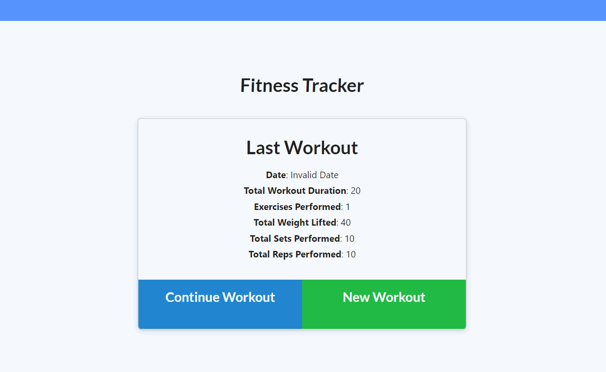

This is a Fitness Tracker app that allos users to track and record their workouts. It works by creating a new workout and then adding excercises to the workout. When complete, the app provides a summary of the stats of the workout. 

This app uses HTLML, CSS, JavaScript, NodeJS, and MongoDB 

I would say the hardest part of creating this homework was reading and unserstanding the pre-written front end of the app. It was structure in a way I was not used to ( API's in a seperate JS file) and It took a decent amount of time understanding the flow of the app and where all of the functions and calls were being executed. 

Overall the app was not too hard to configure with mongo DB once I understood how the app was built to run. 

Some touch ups would be to have the date working on the workout summary (even though the date is saved in mongo), and to revome the continue workout button if there is no workout saved. However I see this as a front-end issue and its not my fault they built it the way they did XD.